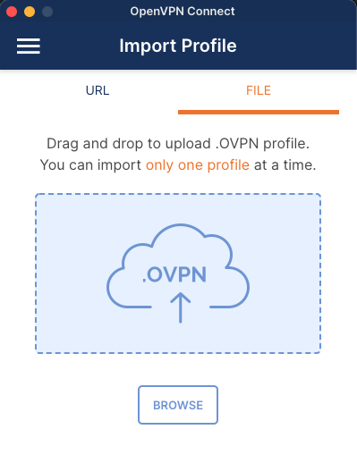

En el siguiente ejercicio vamos a ver como podemos montar nuestro propio
servidor vpn en GCP usando OpenVPN.

Los pasos a seguir son los siguientes:

1. En primer lugar vamos a reservar una IP estática para que la VM no cambie
   su IP cada vez que se reinicie. Para ello usaremos:
   ```shell
   $ gcloud compute addresses create uk-vpn-ip \
      --region=europe-west2
   ```
   A continuación listamos las IPs disponibles en nuestro proyecto:
   ```shell
   $ gcloud compute addresses list
   ```
   lo que nos debería de dar algo así:
   ```shell
   NAME       ADDRESS/RANGE   TYPE      PURPOSE  NETWORK  REGION       SUBNET  STATUS
   uk-vpn-ip  34.105.XXX.YYY  EXTERNAL                                         RESERVED
   ```
   Debemos guardar la IP en algún documento de texto, pues nos hará falta posteriormente.


2. Crear una VM en la zona donde queramos tener el servidor VPN, asignándole la IP que acabamos
   de reservar en el punto anterior. 
   En este ejemplo la zona será `europe-west2-a` (Londres), con el objetivo de poder ver noticias restringidas de UK. 
   Para corremos el comando:
   
   ```shell
   $ gcloud compute instances create vpn-instance \
     --zone=europe-west2-a \
     --address=34.105.XXX.YYY \
     --machine-type=e2-small \
     --image=debian-10-buster-v20210916 \
     --image-project=debian-cloud \
     --boot-disk-size=10GB 
   ```
   
3. Una vez tenemos la VM creada, vamos a conectarnos a ella e installar OpenVPN:

  ```shell
  $ gcloud compute ssh --zone "europe-west2-a" "tmp-user@vpn-instance"
  ```

4. Estando dentro de la VM procedemos a ejecutar los siguientes comandos:
   
  ```shell
  $ sudo apt-get update && sudo apt-get install wget -y && wget https://raw.githubusercontent.com/migduroli/asr-cloud/main/02-open-vpn/openvpn-install.sh && chmod a+x openvpn-install.sh 
  ```

5. A continuación comenzamos con la instalación de OpenVPN:
 
  ```shell
  $ sudo ./openvpn-install.sh
  ```

  Y a continuación tendremos que tener el cuidado de confirmar la siguiente información:

   * Public IPv4 address / hostname [34.105.XXX.YYY] 34.105.XXX.YYY  
   * Which protocol should OpenVPN use? UDP (2)
   * What port should OpenVPN listen to? 443
   * Select a DNS server for the clients: (2)
   * Enter a name for the first client [client]: LondonVPN

  Tras una espera de unos minutos, se nos indicará que la instalación ha acabado, y se nos informará 
  de la ruta donde se han generado las credenciales del cliente, será algo así como `/root/LondonVPN.ovpn`. 
  Y copiamos el fichero desde `root` al usuario `tmp-user`:

  ```shell
  $ sudo cp /root/LondonVPN.ovpn ~/.
  ```

6. Para continuar, tenemos que descargarnos el fichero del cliente (`LondonVPN.ovpn`) a nuestro
   directorio local. Para ello:
   
   ```shell
   $ gcloud compute scp \
      tmp-user@vpn-instance:LondonVPN.ovpn ~/. \
      --zone=europe-west2-a
   ```

7. Por último, hemos de permitir el tráfico UDP en el puerto 443 a las IPs externas que deseemos. 
   En este ejemplo permitiremos todas las IPs externas:
   ```shell
   $ gcloud compute firewall-rules create london-vpn-udp \
      --direction=INGRESS \
      --priority=1000 \
      --network=default \
      --action=ALLOW \
      --rules=udp:443,udp:1194 \
      --source-ranges=0.0.0.0/0
   ```
   
8. Ahora solo tenemos que descargarnos el cliente [OpenVPN](https://openvpn.net/download-open-vpn/) 
   para nuestro OS. Cuando lo hayamos descargado, solo tenemos que abrir y seleccionar la
   opción de cargar perfil desde archivo:
   
   
   
   Una vez carguemos la configuración, podemos comprobar que nuestra IP se encuentra de 
   hecho localizada en Londres, GB. Para ello podemos visitar la [web](https://whatismyipaddress.com/).
   
Para evitar incurrir en gastos innecesarios que acabarían con nuestros créditos
gratuitos, podemos proceder a la limpieza del proyecto ejecutando el script [clean-all.sh](clean-all.sh).