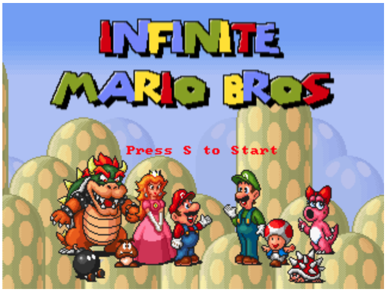

### Introducción

En este ejemplo damos un paso más hacia la exploración y explotación de la flexibilidad que
nos ofrece la nube. Y para ello, vamos a pasarlo bien, vamos a desplegar una aplicación
que ofrece la posibilidad de jugar a Super Mario Bros en un explorador. Para ello vamos a
usar una imagen pública de Docker. En este ejercicio no crearemos una VM, sino que crearemos
un entorno mucho más realista, que se conforma de los siguientes ingredientes:

- Un *template* de VM que será el que usaremos como patrón para las VMs que se lanzarán
  automáticamente acorde a la utilización que se esté teniendo del servicio
  
- Un grupo gestionado de instancias (*Managed Instance Group* [MIG]), el cuál asignaremos
  la posibilidad de autoescalarse en función de la utilización de la CPU de las VMs, 
  seleccionando un mínimo y un máximo de VMs (instancias) que queremos tener en funcionamiento
  
- Un balanceador de carga que nos permitirá servir con una única IP (estática) todas 
  las máquinas, y que hará el trabajo de redireccionar el tráfico entrante a las máquinas
  que estén menos cargadas


El objetivo principal de este ejemplo es el mostrar las posibilidades ofertadas por
la nube pública en términos de flexibilidad y automatización en la gestión de la infraestructura.
El ejercicio nos servirá también para mostrar lo complejo que esta tarea puede llegar a ser
en el caso de proyectos bastante complejos, y ésto nos servirá como puente para comenzar
a presentar ciertos PaaS ofertados por Google que nos facilitarán mucho la vida. 

### La aplicación: Autoscaled-SuperMario

A continuación enumeramos y describimos los pasos necesarios para llegar a tener un 
SuperMario autoescalable servido a través de una única IP fija:

1. En primer lugar vamos a generar la imagen de Docker que será usada para crear el prototipo
   de VM. Para ello usamos el fichero [Dockerfile](Dockerfile):
   ```shell
   PROJECT=$(gcloud config get-value project)
   APP_IMAGE_URI="gcr.io/$PROJECT/$app_img"
   docker build --tag $APP_IMAGE_URI .
   docker push "$APP_IMAGE_URI"
   ```
   donde `$app_img` es una variable de configuración que podemos encontrar en el fichero [config.ini](config.ini)

2. Teniendo la imagen subida a nuestro *Container Registry* privado, podemos proceder con
   la creación del prototipo de VM:
   ```shell
   gcloud compute instance-templates create-with-container $instance_template \
      --tags=http-server,https-server \
      --machine-type=e2-medium \
      --container-image=$APP_IMAGE_URI
   ```
   Al igual que en el paso anterior, `$instance_template` es una variable de configuración, 
   que contiene el nombre que le queremos dar al *instance template* (en este caso hemos 
   puesto como valor por defecto, `supermario`)

3. En este momento estamos en posición de poder comenzar con la creación del MIG, sin embargo
   vamos a proceder con la reserva de la IP estática que le daremos al balanceador de carga a 
   posteriori, para no olvidarlo:
   ```shell
   gcloud compute addresses create $app_ip \
      --ip-version=IPV4 \
      --global \
      --quiet
   APP_IP=$(gcloud compute addresses list | awk '$1=="supermario-ip" {print $2}')
   ```
   
4. Y continuamos con algo de networking, creando ya la regla que permitirá acceder al puerto
  `8080`:
   ```shell
    gcloud compute firewall-rules create "default-allow-external-$app_port" \
      --direction=INGRESS \
      --priority=1000 \
      --network=default \
      --action=ALLOW \
      --rules=tcp:"$app_port" \
      --source-ranges=0.0.0.0/0
   ```

5. A continuación procedemos a la creación del grupo gestionado de instancias (MIG) mediante 
   el prototipo de VMs que hemos creado anteriormente:
   ```shell
    gcloud compute instance-groups managed create $instance_group \
        --base-instance-name=$instance_group \
        --template=$instance_template \
        --size=1 \
        --zones=us-central1-b,us-central1-c,us-central1-f \
        --instance-redistribution-type=PROACTIVE \
        --target-distribution-shape=EVEN
   ```
   Ahora configuramos las opciones de auto-escalado:
   ```shell
   gcloud compute instance-groups managed set-autoscaling $instance_group \
      --region "us-central1" \
      --min-num-replicas "$min_num_replicas" \
      --max-num-replicas "$max_num_replicas" \
      --target-cpu-utilization "$target_cpu_utilization" \
      --cool-down-period "60" \
      --mode "on"
   ```
   Y por último, se configura el puerto al que se conectará el balanceador
   de carga:
   ```shell
   gcloud compute instance-groups managed set-named-ports $instance_group \
      --region=us-central1 \
      --named-ports=http:8080
   ```
   
6. Para poder crear el balanceador de carga, necesitamos crear un *health checker*,
   que básicamente es un servicio que se encarga de comprobar que los servicios de backend
   que se van a servir a través del balanceador están en condiciones adecuadas. Esta comprobación
   se hace de manera automática y a corde a parámetros configurables, que nosotros dejaremos
   por defecto:
   ```shell
   gcloud compute health-checks create tcp "$app_img-healthcheck" --port=8080
   ```
   
7. Una vez creado el health-check, ya podemos proceder a la creación del servicio *back-end*,
   que básicamente es un servicio que conecta con nuestro MIG (recientemente creado):
   ```shell
   gcloud compute backend-services create "$app_img-backend" \
        --protocol=HTTP \
        --port-name=http \
        --health-checks="$app_img-healthcheck" \
        --global

   gcloud compute backend-services add-backend "$app_img-backend" \
        --instance-group=$instance_group \
        --instance-group-region=us-central1 \
        --balancing-mode=UTILIZATION \
        --max-utilization=0.8 \
        --global
   ```
   
8. Por último se crea el servicio *front-end* y el redireccionamiento necesario:
   ```shell
   gcloud compute url-maps create "$app_img-frontend" \
    --default-service "$app_img-backend"
    
   gcloud compute target-http-proxies create http-lb-proxy \
    --url-map="$app_img-frontend"
    
   gcloud compute forwarding-rules create http-content-rule \
    --address=$APP_IP \
    --global \
    --target-http-proxy=http-lb-proxy \
    --ports=8080
   ```
   
Todos estos pasos se encuentran ya incluidos en el script de despliege: [deployment.sh](deployment.sh).
Para proceder con el despliegue automatizado solo tenemos que ejecutar:

```shell
chmod a+x deployment.sh && ./deployment.sh
```

Una vez haya acabado el despliegue, no tendremos más que copiar la que reservamos anteriormente
para el balanceador de carga, ir a un explorador web y pegarla: `123.123.123.123:8080`. 
Deberíamos ver algo así:



Ahora solo queda jugar, compartir IP con todos nuestros clientes, y ver como nuestro servicio
de SuperMario online es capaz de autoescalarse eficientemente.

### Liberación de los recursos
Para evitar incurrir en gastos innecesarios que acabarían con nuestros créditos
gratuitos, podemos proceder a la limpieza del proyecto ejecutando el script [clean.sh](clean-all.sh):

```shell
chmod a+x clean.sh && ./clean.sh
```